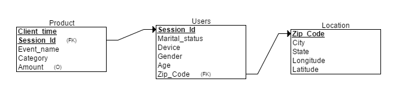

## Bioinformatician Data Assignment

Clean the global environment and set up plot settings
```{r Clean_Environment}
rm(list = ls())
tropical=  c('darkorange', 'dodgerblue', 'hotpink', 'limegreen', 'yellow')
palette(tropical)
par(pch = 19)
```

```{r load_hidden, echo = FALSE, results="hide"}
suppressPackageStartupMessages({
  library(ggplot2)
  library(tidyjson)
  library(dplyr)
  library(jsonlite)
  library(DBI)
  library(RMySQL)
})
```

### Load libraries
```{r loadLibs}
library(ggplot2)
library(tidyjson)
library(dplyr)
library(jsonlite)
library(DBI)
library(RMySQL)
```


### Question 1
First load the Json data unflattened     
```{r LoadData,  cache = TRUE}
setwd("C:/Users/shubh/OneDrive/Documents/data-viz-challenge-master/")
testData1 <- fromJSON("data.json")
class(testData1)
names(testData1)
class(testData1$data)
```

<br><br>

**Read the metrics of data and other properties**
```{r DataStats, cache = TRUE}
names(testData1$data)
dim(testData1$data)
head(testData1$data, n = 5)
table(testData1$data$category)
table(testData1$data$event_name)
table(testData1$data$gender)
table(testData1$data$age)
table(testData1$data$marital_status)
dim(unique(testData1$data[6]))[1] # Counting number of users(unique) who responded
dim(testData1$data[6])[1] # It shows that users have responded multiple times
table(testData1$data$device)
testData1$data$client_time[1:19] # Looking at time to see the format
summary(testData1$data$amount)
class(testData1$data$location)
names(testData1$data$location)
sort(table(testData1$data$location$state), decreasing = TRUE) # Number hits from each state 
```
<br> <br>
**Test Schema**


### Send data to MYSQL
```{r MySQL, warning=FALSE,  cache = TRUE}
mydb = dbConnect(MySQL(), user='root', password='TestCode', dbname='testdatadb', host='localhost')
dbListTables(mydb)
dbSendQuery(mydb, 'drop table if exists location, users, product')
dbWriteTable(mydb, name='location', value = subset(testData1$data$location,  !(duplicated(testData1$data$location))))
users_df = subset(testData1$data, select=c(session_id , marital_status, device, gender, age))
users_df["zip_code"] <- testData1$data$location$zip_code
dbWriteTable(mydb, name='users', value = users_df)
product_df = subset(testData1$data, select=c(client_time, session_id , event_name, category, amount))
product_df$amount[is.na(product_df$amount)] <- 'NULL'
dbWriteTable(mydb, name='product', value = product_df)
dbListTables(mydb)
rs = dbSendQuery(mydb, "select * FROM location")
dat = fetch(rs, n=-1)
dat[1:5,]
dbDisconnect(mydb)
```

<br><br>

### Visualize the data using plot and ggplot2
```{r DataViz1, fig.align = 'center'}
counts <- table(testData1$data$event_name, testData1$data$category)
barplot(counts, main="Funded project and  Viewed project", xlab="Categories", ylab="Number of hits", col=c("orange","green"), beside=TRUE, ylim = c(0,6000))
legend("topright", legend = rownames(counts), fill = c("orange","green"), bty = "n")
ggplot(data=testData1$data, aes(x=category, fill= gender)) + geom_bar(stat="count", position = position_dodge()) +  ggtitle("Number of hits by gender groups across different categories") + xlab("Category per gender") + ylab("Number of hits") 

ggplot(data=testData1$data, aes(x= category, fill= gender)) + geom_bar(stat="count", position = "stack")  + facet_wrap( ~ event_name) + xlab("Category per gender") + ylab("Number of hits") + ggtitle("Number of hits by gender groups across different categories and event")
```

There is no significant difference between number of hits for funded projects across gender groups and categories. Its ratio to viewed projects across different gender groups reflects the same. There is also no considerable difference in inclination towards getting response by either male or female.     
<br>

```{r DataViz2, fig.align = 'center'}
ggplot(data=testData1$data, aes(x= category, fill= age)) + geom_bar(stat="count", position = "stack")  + facet_wrap( ~ event_name) + xlab("Category per event") + ylab("Number of hits") + ggtitle("Response from different age groups across categories")
ggplot(data=testData1$data, aes(x=age, fill= gender)) + geom_bar(stat="count", position = position_dodge()) + xlab("Age groups") + ylab("Number of hits") + ggtitle("Response from different age groups and gender groups")
```

We can see that 18-24 age group is very responsive towards all of the categories. There is only a little variation in response pattern for 24+ groups across different sex as well.

```{r DataViz3, fig.align = 'center'}
ggplot(data=testData1$data, aes(x= marital_status, fill= category)) + geom_bar(stat="count", position = "stack")  + facet_wrap( ~ event_name) + xlab("Marital status / Event") + ylab("Number of hits") + ggtitle("Response variation based on marital status/category")
ggplot(data=testData1$data, aes(x= marital_status, fill= age)) + geom_bar(stat="count", position = "stack")  + facet_wrap( ~ gender) + xlab("Marital status / gender") + ylab("Number of hits")  + ggtitle("Response variation based on marital status and age groups")
ggplot(data=testData1$data, aes(x= category, fill= device)) + geom_bar(stat="count", position = "stack")  + facet_wrap( ~ event_name) + ggtitle("Response variation based on device across categories")
ggplot(data=testData1$data, aes(x= age, fill= device)) + geom_bar(data=subset(testData1$data, event_name =="Fund Project"), stat="count", position = "stack")  + facet_wrap( ~ gender) + ggtitle("Response variation based on device across age groups")
```

Across different marital status, we can say that married people are more responsive than single persons. We also get almost double response from iOS users compared to android users.

```{r DataViz4, fig.align = 'center'}
counts <- table(testData1$data$event_name, testData1$data$location$state)
rownames(counts) # Getting number of hits for View project and Fund project across all states
sort(counts[1,], decreasing = TRUE)
Filt_count = counts[1,counts[1,]>300]
barplot(sort(Filt_count, decreasing = TRUE), main="States with high response for funding", xlab="State", ylab="Number of hits")
Filt_count_low = counts[1,counts[1,]<50]
barplot(sort(Filt_count_low), main="States with low response for funding", xlab="State", ylab="Number of hits")
```

Highest response for funding is from Indiana (IN) and lowest response is from DC state.

```{r DataViz5, fig.align = 'center'}
user_count <- count(testData1$data, session_id) #Getting number of hits per user
class(user_count)
user_counts<- apply(user_count[,2], 1, as.numeric)
class(user_counts)
plot(user_counts, col = 3, xlab = 'User index', ylab = 'Number of hits', main="Total number of hits per user")
par(mfrow = c(1,2))
hist(user_counts, col = 4, breaks = 10, xlab = 'Number of hits', ylab = 'Number of users', main = "Number of users based on hits")
boxplot(user_counts, col = 2, xlab = 'User', ylab = 'Number of hits', main = "Distribution of user response")
c(min(user_counts), median(user_counts), max(user_counts))
# as.character(user_count[which.max(user_counts),1])
```

The minimum, median and maximum user response are 1, 4 and 27, respectively.This box plot suggests us 13 outliers for session_ids statistically. 

```{r Dataviz6, fig.align = 'center'}
x<-as.factor(table(testData1$data$event_name))
c(x[1], x[2])
user_count_view <- count(subset(testData1$data, event_name == labels(x[2])), session_id)
user_count_fund <- count(subset(testData1$data, event_name == labels(x[1])), session_id)
user_counts_view<- apply(user_count_view[,2], 1, as.numeric)
user_counts_fund<- apply(user_count_fund[,2], 1, as.numeric)
par(mfrow = c(1,2))
plot(user_counts_view, col = 3, xlab = 'User index', ylab = 'Number of hits', main = "Hits per user for VIEW Project")
plot(user_counts_fund, col = 2, xlab = 'User index', ylab = 'Number of hits',  main = "Hits per user for FUND Project")
boxplot(user_counts_view, col = 3, xlab = 'View Users', ylab = 'Number of hits', main = "Distribution for View Project")
boxplot(user_counts_fund, col = 2, xlab = 'Fund User', ylab = 'Number of hits', main = "Distribution for Fund Project")
c(median(user_counts_view), median(user_counts_fund))
```

Median value, which is 2, is the same for fund event and view event for number of hits by each user.
<br><br>

**Understanding relation between number of users per category for funded projects only**
```{r Dataviz7, fig.align = 'center'}
subData <- subset(testData1$data, event_name =="Fund Project") #Considering only funded projects
group_by(subData, category,session_id) %>% summarise(newvar = n()) %>% summarise(newvar2 = n())
y <- group_by(subData, session_id) %>% summarise(Fund = sum(amount))
x<- (1:dim(y)[1])
y<- apply(y[,2], 1, as.numeric)
par(mfrow = c(1,2))
plot(x,y, xlab = "User index", ylab = "Amount", main = "Total amount per user")
boxplot(y, xlab = "User index", ylab = "Amount", main = "Distribution of Total amount/user")
c(median(y), mean(y)) # Mean and median of total amount contribution per user
```

Previously, We had seen that number of hits per category was almost same. Here, we see that each category has almost same number of distinct session IDs. It suggests that distribution of user hits is category unbiased. 

<br><br>

### Question 2
**Which parts of the world are more active in funding projects on Bootloader than others?**
```{r Q2}
testData2 <- flatten(subData, recursive = TRUE)
y <- group_by(testData2, location.state)
GrpData <- summarise(y, total_fund = sum(amount), medianAmountPerHit = median(amount), meanAmountPerHit = mean(amount))
names(GrpData)
c(max(GrpData$total_fund), max(GrpData$medianAmountPerHit), max(GrpData$meanAmountPerHit))
# GrpData$location.state[max.col(t(GrpData$total_fund))]
# GrpData$location.state[which(GrpData$total_fund == max(GrpData$total_fund))]
Active_State_totalFund = GrpData$location.state[which.max(GrpData$total_fund)]
Active_State_MedianFund = GrpData$location.state[which.max(GrpData$medianAmountPerHit)]
Active_State_MeanFund = GrpData$location.state[which.max(GrpData$meanAmountPerHit)]
c(Active_State_totalFund, Active_State_MedianFund, Active_State_MeanFund)
```

<br>

The other way to look at active state is state with maximum number of hits (online activity) despite giving more money.    
```{r DataViz10, ```{r DataViz10}
GrpData <- filter(summarise(y, total_fund =sum(amount)), total_fund >10000)
arrange(GrpData, -total_fund)
ggplot(data=testData2, aes(x= location.state,  fill= category)) + geom_bar(data=subset(testData2, location.state == c('IN', 'GA', 'OR', 'CO','CA')), stat="count", position = PositionDodge) + xlab("State") + ylab("Number of hits") + ggtitle("Active state's response based on categories")
```

Geographically, top 4 states which funded project are Indiana (IN), Georgia (GA), Oregon (OR) and Colorado (CO). The high response and fund in some states could be high population or some geographical need these products cater to, which requires some additional information.

The most active state in funding projects on Bootloader is **`r Active_State_totalFund`**.    

<br><br>

### Question 3
**What are some popular traits of a successfully funded project on Bootloader platform?**     
From the above visualization of data, we can say that highly funded project attracts on 18-24 age group, married couple. We have seen that there is almost double response from iOS users, so project should be very friendly to iOS. 

```{r  Dataviz8, fig.align = 'center'}
subData <- subset(testData1$data, event_name =="Fund Project") #Considering only funded projects
group_by( subData, category,session_id) %>% summarise(newvar = sum(amount)) %>% summarise(newvar2 = sum(newvar), mean = mean(newvar), median =  median(newvar))
group_by(subData, gender,age) %>% summarise(newvar = sum(amount), mean = mean(amount), sd = sd(amount), median = median(amount))#Mean and median per age group
group_by(subData, marital_status, device) %>% summarise(newvar = sum(amount), mean = mean(amount), sd = sd(amount), median = median(amount))#Mean and median per device user
```

Funding is category unbiased because every category has got almost same amount of fund and their mean and median values are almost same. Each category has also received the same number of interactive user IDs.       

We can see that median of fund for all age group is same, but there is higher fund available from people of age group of 18-24. Therefore, we can say since 
there are lots of hits from the age group, most of the projects focus on this age group. There are higher funding events as well from this group so best projects improve themselves constantly so that people can fund them later as well. 

Higher funding from Married and iOS users also suggests that successful projects are more focused towards couples and must be easier to interact with on iOS systems.     

```{r}
dateTime <- as.POSIXct(subData$client_time, origin="1970-01-01")
hist(dateTime, breaks = 100, col =5, main = "Distribution of funding event across days")
t <- group_by( subData, client_time) %>% summarise(Fund = sum(amount), mean = mean(amount), median =  median(amount))
x <- apply(t[,1], 1, as.numeric)
fund <- apply(t[,2], 1, as.numeric)
x <- as.POSIXct(x, origin="1970-01-01")
plot(x, fund, col = 5, xlab = "dateTime", ylab = "Fund amount", main = "Total fund received per time event" )
```

So, from the graph it appears that there is not a specific day when notification should be sent as there is no variation in funding amount and number of hits across all days.

**Popular traits for successful Bootloader platforms are:**       
1) Age     
2) Location      
3) Operating system     
4) Marital_status      
<br><br>

### Question 4
**What are some outlier projects that did very poorly or outperformed everyone?**

```{r Q4}
group_by( subData, category, session_id) %>% summarise(user_Totalfund = sum(amount)) %>% summarise( total_fund = sum(user_Totalfund), MeanFund = mean(user_Totalfund), MedianFund = median(user_Totalfund), MaxFund = max(user_Totalfund), MinFund = min(user_Totalfund), Fund_sd = sd (user_Totalfund))

Data_Grp_ID = group_by( subData, category, session_id) %>% summarise(user_Totalfund = sum(amount))

boxplot( Data_Grp_ID$user_Totalfund ~ Data_Grp_ID$category, border = c(1,2,3,4,5), xlab = "Category", ylab = "Amount per user", main = "Distribution of amount per user across categories")

points(Data_Grp_ID$user_Totalfund ~ jitter(as.numeric(as.factor(Data_Grp_ID$category))), col = as.numeric(as.factor(Data_Grp_ID$category)))
```

With the boxplot we can conslude that biggest outlier as per user fund lies in Technology category. so, although Games category has recieved highest amount but Technology category sees largest amount as per individual user's fund .

<br><br>

### Question 5
**What are the different segments of users who are active on this platform? What are the stats/traits of those segments?**

```{r Q5}
group_by( testData1$data, event_name, gender, session_id) %>% summarise(FrequencyPerUser = n())%>% summarise(NumberOfUsers = n())
filter(group_by( testData1$data, event_name, gender, session_id) %>% summarise(AmountPerUser = sum(amount))%>% summarise(AmountPerGender = sum(AmountPerUser), MeanAmountPergender = mean(AmountPerUser), MedianAmountPerGender = median(AmountPerUser)), event_name == "Fund Project")
```

There is no significant difference in total number of hits across both genders. Mean, median and total amount across each gender group also are same. 

```{r age}
group_by( testData1$data, event_name, age, session_id) %>% summarise(FrequencyPerUser = n())%>% summarise(NumberOfUsers = n())
filter(group_by( testData1$data, event_name, age, session_id) %>% summarise(AmountPerUser = sum(amount))%>% summarise(AmountPerAge = sum(AmountPerUser), MeanAmountPerAge = mean(AmountPerUser), MedianAmountPerAge = median(AmountPerUser)), event_name == "Fund Project")
```

We can see that there are higher number of users for age group of 18-24. This plays a significant role in funding. As we can see from second output that although mean and median for Amount per age group are higher for age group of 35-44, total amount per age group for 18-24 comes almost four times of 35-44 as former has higher membership.


```{r device}
group_by( testData1$data, marital_status, device, session_id) %>% summarise(FrequencyPerUser = n())%>% summarise(NumberOfUsers = n())
group_by(subData, marital_status, device, session_id) %>% summarise(AmountPerUser = sum(amount), meanPerDevice = mean(amount), medianPerDevice = median(amount))%>% summarise(AmountPerMS = sum(AmountPerUser), MeanAmountPerMS = mean(AmountPerUser), MedianAmountPerMS = median(AmountPerUser))
group_by(subData, marital_status, device, session_id) %>% summarise(AmountPerUser = sum(amount), meanPerDevice = mean(amount), medianPerDevice = median(amount))%>% summarise(AmountPerMS = sum(AmountPerUser), MeanAmountPerMS = mean(AmountPerUser), MedianAmountPerMS = median(AmountPerUser)) %>% summarise(sum(AmountPerMS), mean = mean(AmountPerMS), median = median(AmountPerMS))
```

These stats are similar to what we have observed in age group. Since there are higher number of user population for married and iOS user group. We see higher contribution from married and iOS user group section. In last output we see that married couple are more attracted to projects compared to single persons. As their median value is higher than single ones. So, they contribute more for each project than single persons.      
For location segment, analysis is already presented in question number 2.

### Session Info
```{r sessionInfo}
devtools::session_info()
```

### Last compilation
Last compiled at `r Sys.Date()`.